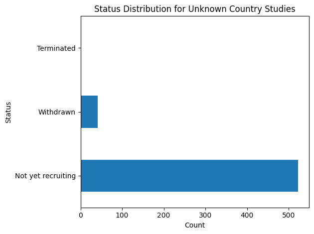

# COVID-19-clinical-trials

## Project Description
This repository contains a Jupyter Notebook focused on the Data Engineering and Analysis of ClinicalTrials.gov COVID-19 datasets.
The project implements a pipeline to clean unstructured clinical data and explores key insights about the global research landscape during the COVID-19 pandemic, covering study types, phases, enrollment, therapeutic focus areas, failure and geographic distribution of trials.
A second Jupyter Notebook contains the preparation of the raw dataset to structured tables designed dor MySQL integration

## Questions Raised
1. Landscape Overview:
   - How were trials distributed by type, status and phase?
   - How Status evolved over time?
   - What were the most studied conditions and comorbidities alongside COVID-19?
2. Failure Analysis:
   - Which aspects are associated with unsuccessful trials?
3. Enrollment Performance:
   - What type of studies had higher enrollment and why?
4. Geographical Overview:
   - What countries led the research?
5. Duration Analysis:
   - What was the typical trial duration by phase?
   - What trials took longer than expected?

## Key Insights

### 1. Landscape overview

- The majority of studies are Interventional (57.2%), reflecting the urgency to find effective treatments and vaccines during the pandemic. 
- Observational studies represent a significant share (42.2%), indicating the need to monitor and understand the disease's progression and long-term effects across populations. 
- Expanded Access (0.6%) represents a negligible fraction, as expected. These programs provide patients with serious conditions access to investigational treatments outside of formal clinical trials and have an exceptional nature.


- Most of the Studies were in the Recruiting and Not yet recruiting phases. The peak of trial registrations occurred in 2020, coinciding with the outbreak of the pandemic.


- Considering all trials, the majority fall under 'Not Applicable' (N/A), which is expected given the large proportion of Observational studies in the dataset. These studies don't follow a regular clinical trial structure devided by phases.
- When focusing on Interventional studies only, N/A still dominates, which may be related to the status (inspected ahead).
- Excluding N/A results, Phase 2 and phase 3 comprise the majority of the clinical trials.


- When plotting the phases against the status, it was confirmed that the reason why there was so many Interventional studies without attributed phase, was because these were still in the 'Not yet recruiting' and 'Recruiting' stages.


- Looking at the top therapeutic focus areas, the research was predominantly centered around respiratory conditions, which aligns with the known clinical severity of COVID-19 on the respiratory system. Notably, Anxiety and Depression also ranked prominently, reflecting the significant mental health burden imposed by the pandemic on the general population.


### 2. Failure Analysis
- Focusing on unsuccessful studies (Withdrawn, Terminated, Suspended), the majority were associated to Academic and Public funders (typically categorized as 'Others'). In these institutions, resources are more limited which could explain the higher failure rates.


- These unsuccessfull studies were mostly on the phases 2 and 3. While, failure at Phase 2 (Exploratory phase) could be due to insufficient efficay, failure at Phase 3 (Confirmatory phase) may be due to budgetary struggles or loss of interest.
- Observational studies typically rely on existing records and databases, making it easier and less costly to include large numbers of participants. When inspecting the the titles of the studies with the largest enrollment numbers, these were found to be related to Apps and Big Data projects. Technology-driven research allows projects to attract participants more easily than traditional methods.
- Interventional studies, on the other hand, require direct intervention and close monitoring of each participant, which naturally limits the scale of recruitment.


### 3. Enrollment Performance
- Observational studies were found to  enroll more participants than Interventional studies, with a median of 300 vs 120 respectively.


### 4. Geographical Overview
- The countries that led the research are the USA (by far), France and United Kingdom. A large volum of studies with Unkown location was observed. These correspond mainly to studies that are Not recruiting yet, which indicates that the location where the studies will be conducted is yet to be determined.




### 5. Duration Analysis
- The majority of studies across all phases appear to have completion dates between 2020 and 2025.
- As expected, Phase 1 and Phase 2 studies tend to have the longest durations (with exception of some outliers). This is consistent with the nature these trials which assessment of safety and efficacy.

 

- When focusing specifically at the studies with unusually long completion dates (extending beyond 2026), these were found to be predominantly conducted in Egypt, with Tanta University standing out as the lead sponsor with the highest number of outlier studies. Naturally, this is reflected in the funding sources where the majority falls under 'Other'.

 

## Conclusions
The analysis revealed a highly dynamic ecosystem where Interventional studies dominated the research effort to find immediate clinical solutions, while Observational research provided the necessary scale through Big Data and technology-driven recruitment to understand the disease's broader impact. By identifying failure patterns in critical stages (Phases 2 and 3) and uncovering geographical outliers in trial durations, this pipeline proves its value in filtering noise and pinpointing logistical anomalies within the global research landscape.

## Project Structure
```text
COVID-19-clinical-trials/
├── src/Data/  
│         ├── processed/                   
|         |     ├── DF_COVID_CLEAN.csv
|         |     └── structured tables/
|         |                ├── interventions_table.csv 
|         |                ├── locations_table.csv
|         |                ├── sponsors_table.csv
|         |                ├── studies_table.csv
|         |                └── study_design_table.csv
│         └── raw/ 
|              └──COVID clinical trials.csv
├── notebooks/
│       ├── Data cleaning and EDA.ipynb
│       └── Preparation for MySQL.ipynb
├── outputs/plots/
├── MySQL schema/
└── README.md   
```

## Tools
- Language: Python 3.15.3+
- Data Manipulation: Pandas, NumPy
- Visualization: Matplotlib, Seaborn
- Standard Library: `os` (File System Management)
- Database Management: MySQL

## Final considerations
- Performed all the analysis and vizualization on Python
- During the Cleaning phase, some columns (eg.'Acronym'). When loading the clean dataset to MySQL, the dropped columns were not included
- The Schema is missing the tables 'conditions' and 'outcomes'. Tried using ReGex to extract and clean information from 'Outcome Measures' and 'Conditions' but the results were not satisfatory.
- AI was heavily used to generate the code
