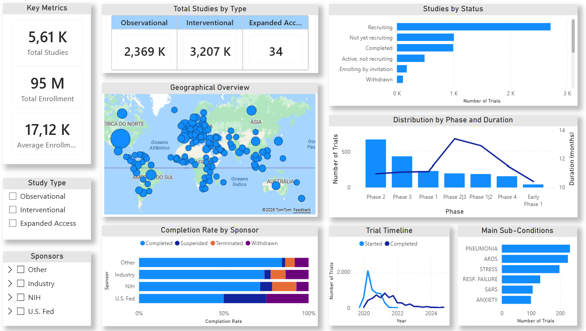

# COVID-19-clinical-trials

## 🎯 Summary
This project analyzes the global landscape of COVID-19 clinical research. By engineering a pipeline from raw ClinicalTrials.gov data to a structured MySQL database. The goal was to uncovered key patterns in trial landscape, success, enrollment, and geographic distribution.


**Note:** For the full interactive experience, open the outputs/dashboard.pbix file with Power BI Desktop.

---

## 📐 Project Architecture

The project follows a modular Data Engineering pipeline:

1. Extraction & Cleaning: notebooks/Data cleaning and EDA.ipynb

2. Structured Modeling: notebooks/Preparation for MySQL.ipynb

3. Database Integration: MySQL schema with optimized views for BI.

4. Interactive Visualization: Power BI Dashboard.

---

## ❓ Questions Raised
1. Landscape Overview:
   - How were trials distributed by type, status and phase?
   - How Status evolved over time?
   - What were the most studied conditions and comorbidities alongside COVID-19?
2. Failure Analysis:
   - Which aspects are associated with unsuccessful trials?
3. Enrollment Performance:
   - What type of studies had higher enrollment and why?
4. Geographical Overview:
   - What countries led the research?
5. Duration Analysis:
   - What was the typical trial duration by phase?
   - What trials took longer than expected?

---

## 💡 Key Findings
* **Trial Landscape:** 57% of studies were Interventional, with a massive surge in 2020. Most "Not Applicable" phases correlate with Observational studies and Big Data projects.

* **Failure Patterns:** Federal and Public funders show higher termination rates in Phases 2 and Phase 3, likely due to funding constraints compared to Industry-led trials.

* **Enrollment Drivers:** Observational trials achieved significantly higher medians (300 vs 120) by leveraging technology and mobile apps for recruitment.

* **Geographic Outliers:** While the USA leads research volume, Egypt (Tanta University) emerged as a significant outlier with trials projected far beyond 2026.
  
* **Duration Dynamics:** Clinical trials typically last 10–12 months, but combined Phase 2|3 studies show the longest average duration (~13.5 months), highlighting the logistical complexity of merging exploratory and confirmatory objectives.

🔍 For a deep dive into all research questions and detailed charts, check the [EDA Report](docs/EDA_report.md)

---

## 🚀 Quick Start

1. **Clone the repository:**
   `git clone https://github.com/marcelodcatarino-sudo/COVID-19-clinical-trials.git`

2. **Setup Environment:**
   - Create a `.env` file based on `.env.example`.
   - Install dependencies: Check requirements.txt

3. **Database Setup:**
   - Run the script in `MySQL schema/covid19_db.sql` to create the database structure.

     ---
     
## 📂 Project Structure
```text
COVID-19-clinical-trials/
├── src/Data/  
│         ├── processed/                   
|         |     ├── DF_COVID_CLEAN.csv
|         |     └── structured tables/
|         |                ├── conditions_table.csv
|         |                ├── interventions_table.csv 
|         |                ├── locations_table.csv
|         |                ├── outcome_table.csv
|         |                ├── sponsors_table.csv
|         |                ├── studies_table.csv
|         |                └── study_design_table.csv
│         └── raw/ 
|              └── COVID clinical trials.csv
├── notebooks/
│       ├── .env.example
│       ├── Data cleaning and EDA.ipynb
│       └── Preparation for MySQL.ipynb
├── notebooks/
│       └── EDA_report.md
├── outputs/
│       ├── dashboard.pbix
│       └── plots/
|             ├── Dist_of_enrollment_interv_vs_Obs.png
|             ├── da_completion_without_outliers.png
|             ├── da_completionbyphase.png
|             ├── da_inspectionofoutliers.png
|             ├── failure_by_funder.png
|             ├── failure_by_phase.png
|             ├── geographic_top10.png
|             ├── geographic_unknowns.png
|             ├── landscape_phase_dist.png
|             ├── landscape_phasesvsstatus.png
|             ├── landscape_status_dist.png
|             ├── landscape_statusbystarty.png
|             ├── landscape_studytypedist.png
|             ├── landscape_therapeutic_focus.png
|             └── total studies_Interv vs Obs.png
├── MySQL schema/
|        ├── Covid19_db.sql
|        └── SQL Queries.sql
├── README.md
└── requirements.txt
```
---

## 🛠️ Tools
- Local Environment: Windows 11 (Architecture: amd64)
- Development: Jupyter Notebook / VS Code
- Language: Python 3.15.3
- Data Manipulation: Pandas, NumPy, re
- Visualization: Matplotlib, Seaborn, IPython.display, Power BI
- Standard Library & Utilities: `os` (File System Management), python-dotenv (Environment Variable Management)
- Database Management: MySQL 8.0.44, SQLAlchemy, PyMySQL

---

## 📝 Final Considerations and Improvements

- File 'SQL queries' contains a set of queries to demonstrate the ability to conduct data retrieval, aggregation and table joins 
- AI was heavily used to generate the code
- Wasn't able to use Docker for containerization. To run this project locally, please find the libraries listed in requirements.txt
