# Exploratory Data Analysis Report: COVID-19-clinical-trials

This report details the findings extracted from the ClinicalTrials.gov dataset, focusing on the global research dynamics during the COVID-19 pandemic.

## Questions Raised
1. Landscape Overview:
   - How were trials distributed by type, status and phase?
   - How Status evolved over time?
   - What were the most studied conditions and comorbidities alongside COVID-19?
2. Failure Analysis:
   - Which aspects are associated with unsuccessful trials?
3. Enrollment Performance:
   - What type of studies had higher enrollment and why?
4. Geographical Overview:
   - What countries led the research?
5. Duration Analysis:
   - What was the typical trial duration by phase?
   - What trials took longer than expected?

---

## Key Insights

* **Interventional Dominance:** 57.2% of studies focused on direct treatments, with a massive registration peak in 2020.
* **Recruitment Efficiency:** Observational studies significantly outperform Interventional trials in participant volume (Median 300 vs 120).
* **Failure Patterns:** Academic and Federal institutions show higher early termination rates in critical stages (Phases 2 and 3).
* **Geographic Anomalies:** A significant volume of unusually long-duration studies was identified in Egypt, specifically linked to Tanta University.

---

## Table of Contents
1. [Landscape Overview](#1-landscape-overview)
2. [Failure Analysis](#2-failure-analysis)
3. [Enrollment Performance](#3-enrollment-performance)
4. [Geographical Overview](#4-geographical-overview)
5. [Duration Analysis](#5-duration-analysis)

---

### 1. Landscape overview

- The majority of studies are Interventional (57.2%), reflecting the urgency to find effective treatments and vaccines during the pandemic. 
- Observational studies represent a significant share (42.2%), indicating the need to monitor and understand the disease's progression and long-term effects across populations. 
- Expanded Access (0.6%) represents a negligible fraction, as expected. These programs provide patients with serious conditions access to investigational treatments outside of formal clinical trials and have an exceptional nature.

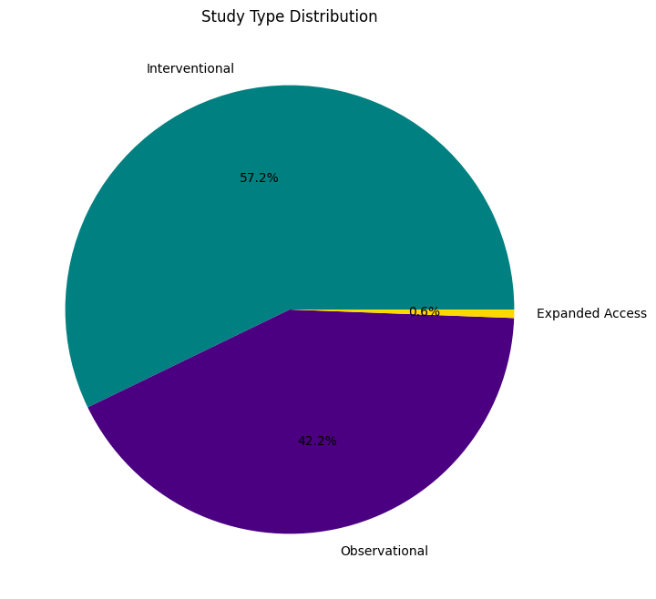

- Most of the Studies were in the Recruiting and Not yet recruiting phases. The peak of trial registrations occurred in 2020, coinciding with the outbreak of the pandemic.

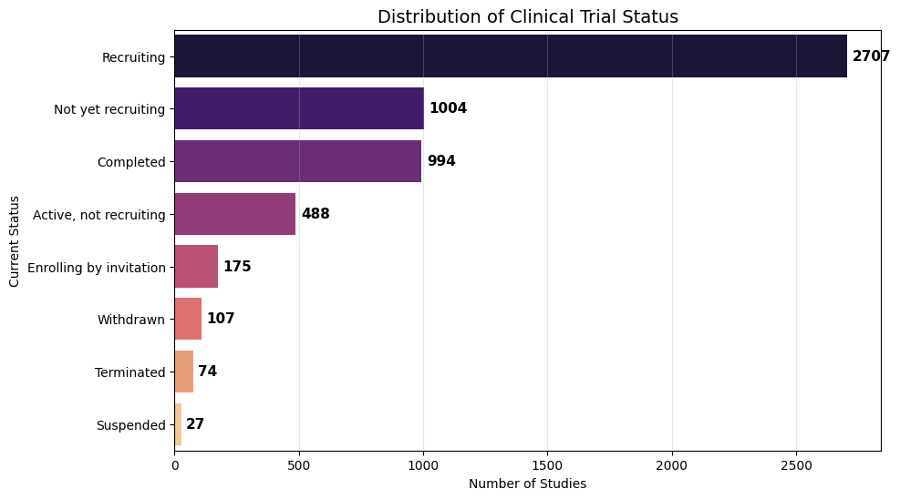
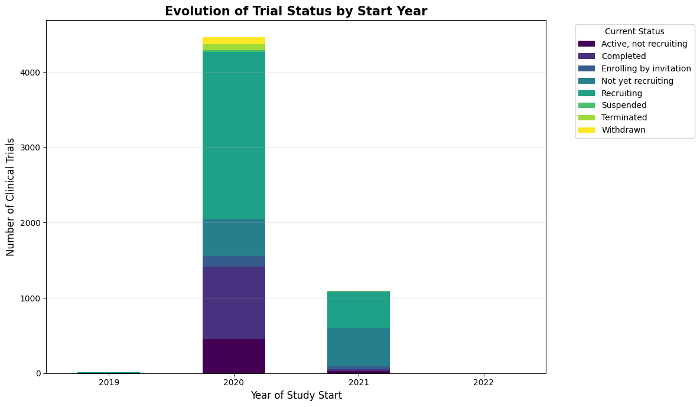

- Considering all trials, the majority fall under 'Not Applicable' (N/A), which is expected given the large proportion of Observational studies in the dataset. These studies don't follow a regular clinical trial structure devided by phases.
- When focusing on Interventional studies only, N/A still dominates, which may be related to the status (inspected ahead).
- Excluding N/A results, Phase 2 and phase 3 comprise the majority of the clinical trials.

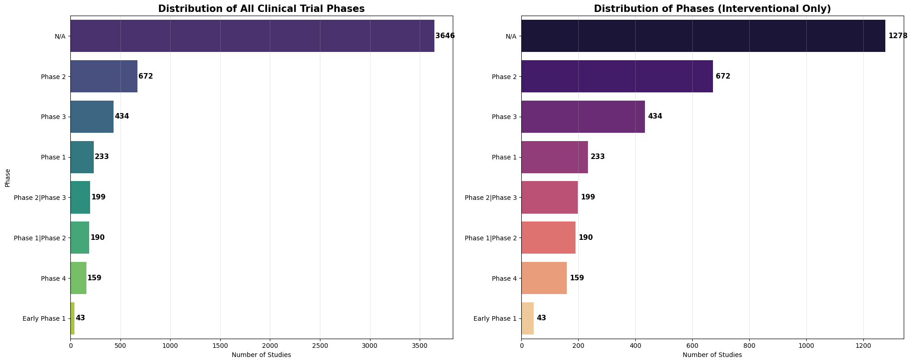

- When inspecting the Interventional trials with 'N/A' phases, a high association (Chi-square p-value < 0.001) with the trial Status was found. The majority of these trials were highly distributed between the 'Not yet recruiting' and 'Recruiting' stages.

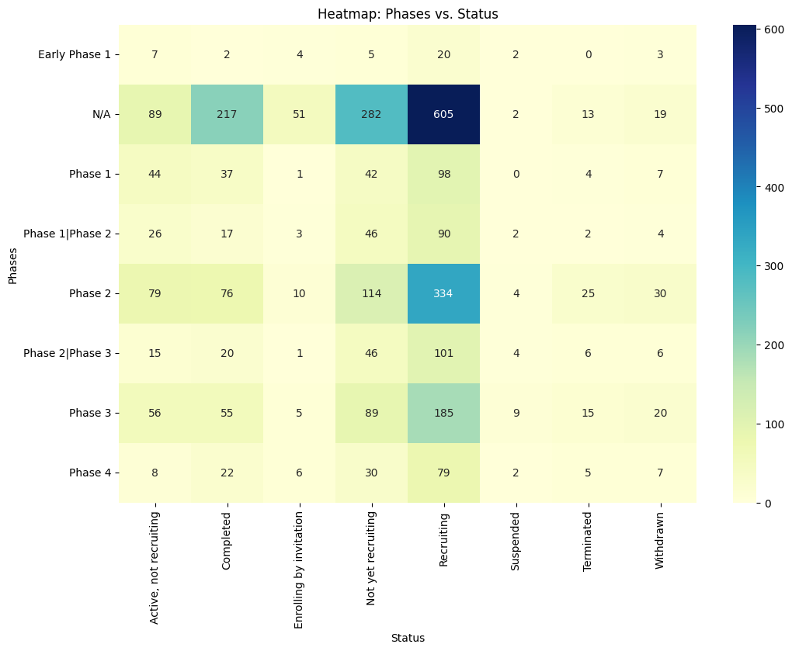

- Looking at the top therapeutic focus areas (apart from COVID-19), data shows that research was predominantly centered around subconditions such as respiratory complications, which aligns with the known clinical severity of COVID-19 on the respiratory system. Notably, Stress, Anxiety and Depression also ranked prominently, reflecting the significant mental health burden imposed by the pandemic on the general population.

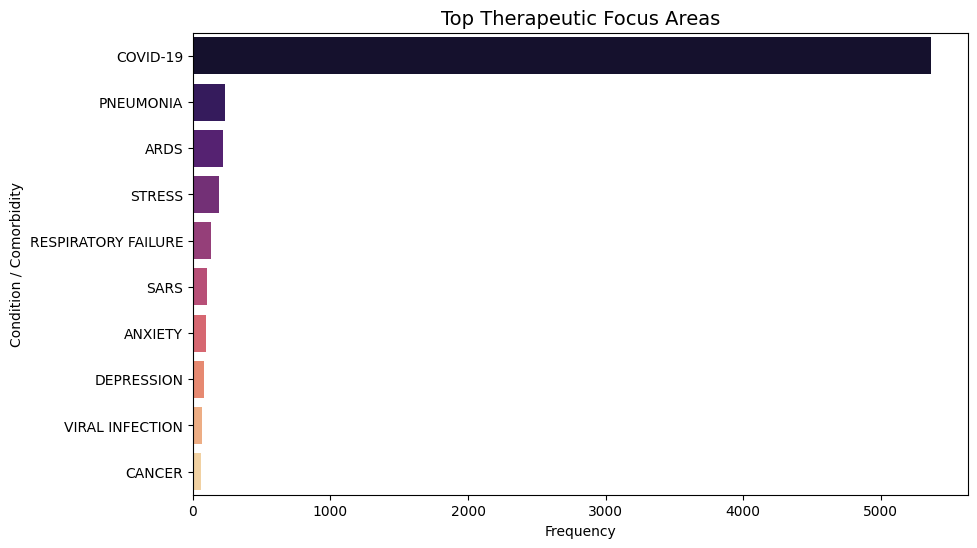

---

### 2. Failure Analysis
- Focusing on unsuccessful studies (Withdrawn, Terminated, Suspended), the majority were associated to Public (typically categorized as 'Others') and Federal funders ($p < 0.001$). In these institutions, resources are more limited which could explain the higher failure rates.

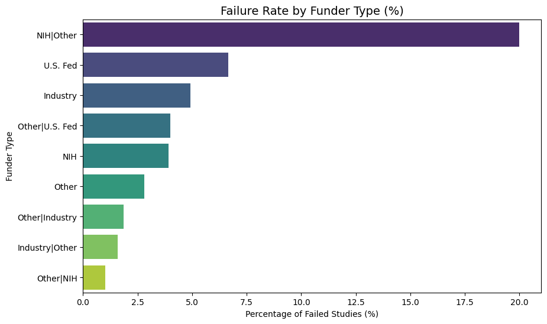

- While failures are concentrated in Phase 2 (Exploratory) and Phase 3 (Confirmatory), the Chi-square test indicates that the risk of failure is actually distributed relatively evenly across all clinical stages ($p = 0.12$). Whether a trial failed due to early efficacy issues (Phase 2) or late-stage budgetary/logistical hurdles (Phase 3), the operational environment was hostile at every phase.

- The strongest predictor of failure in this dataset is the Study Type ($p \approx 0$). Interventional trials carried a significantly higher risk profile. These outcomes are likely attributable to the heightened scientific and logistical hurdles of the pandemic. Such disruptions disproportionately affected Interventional research, whereas Observational studies, requiring less physical infrastructure, were largely insulated from these factors.

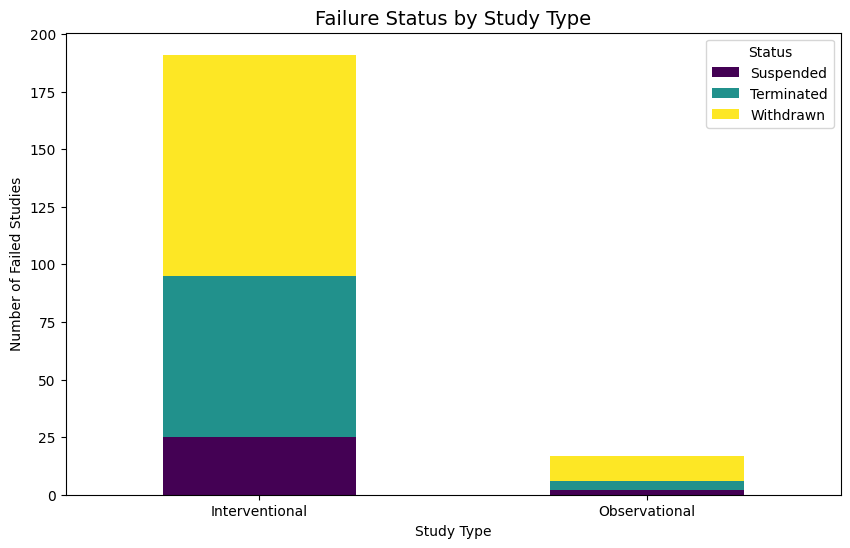

---

### 3. Enrollment Performance
- Observational studies were found to  enroll more participants than Interventional studies, with a median of 300 vs 120 respectively.

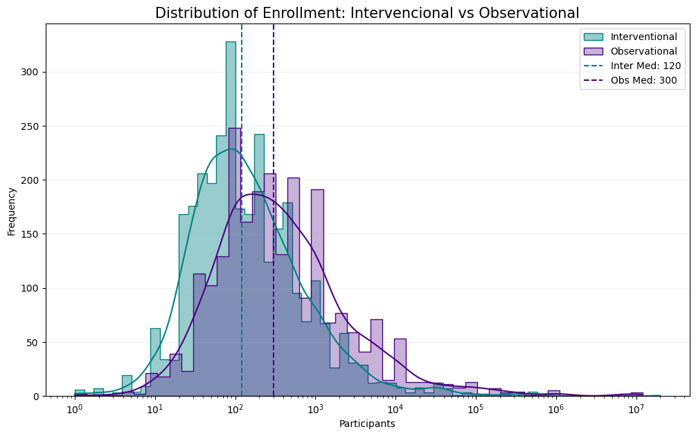

---

### 4. Geographical Overview
- The countries that led the research are the USA (by far), France and United Kingdom, representing approximately 40% of the total trials. A large volum of studies with Unkown location was observed. These where found to be tightly associated ($p \approx 0$) with the trial status, with the majority being in the 'Not yet recruiting' phase

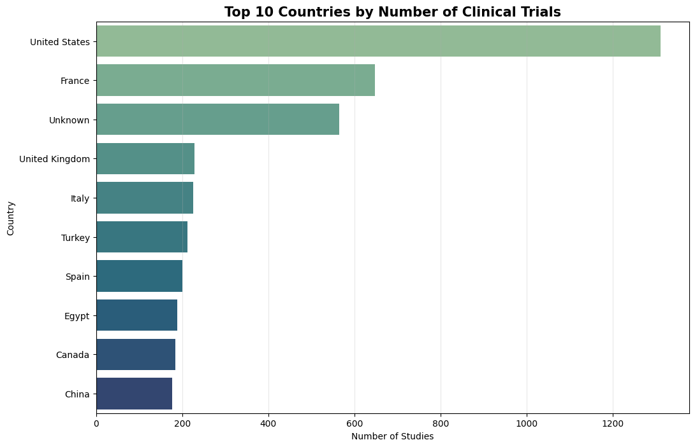

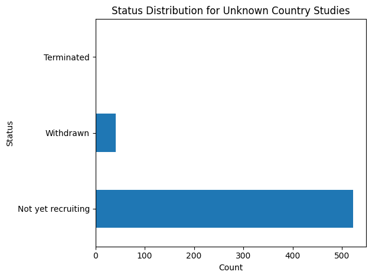

---

### 5. Duration Analysis
- A weak Spearman correlation (0.19) between Enrollment and Duration reveals that large-scale studies did not correlate to longer trials. The low p-value ($p \approx 0$) indicates that this correlation is statistically significant. In practical terms, this means trial duration remains relatively consistent regardless of whether it involves a large or small number of participants

 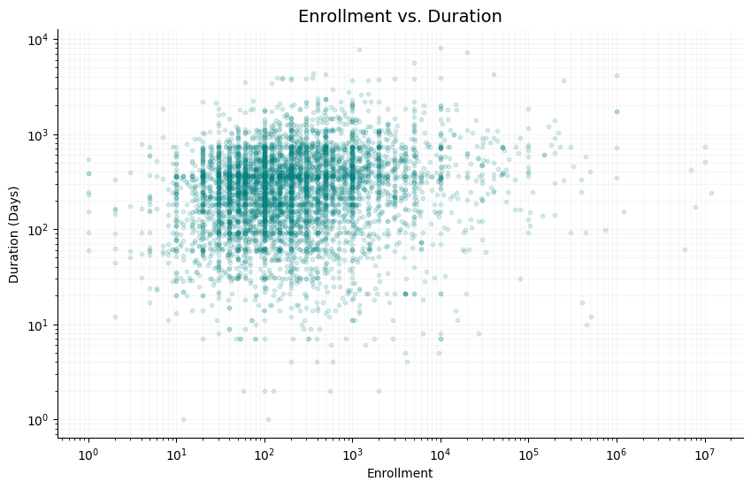

- A strong association between trial phase and duration was also confirmed (($p < 0.001)$), with hybrid studies (Phase 1|Phase 2) being slowest to complete (Median: 335 days), likely because they combine the safety requirements of early phases with the efficacy monitoring of later stages. 

 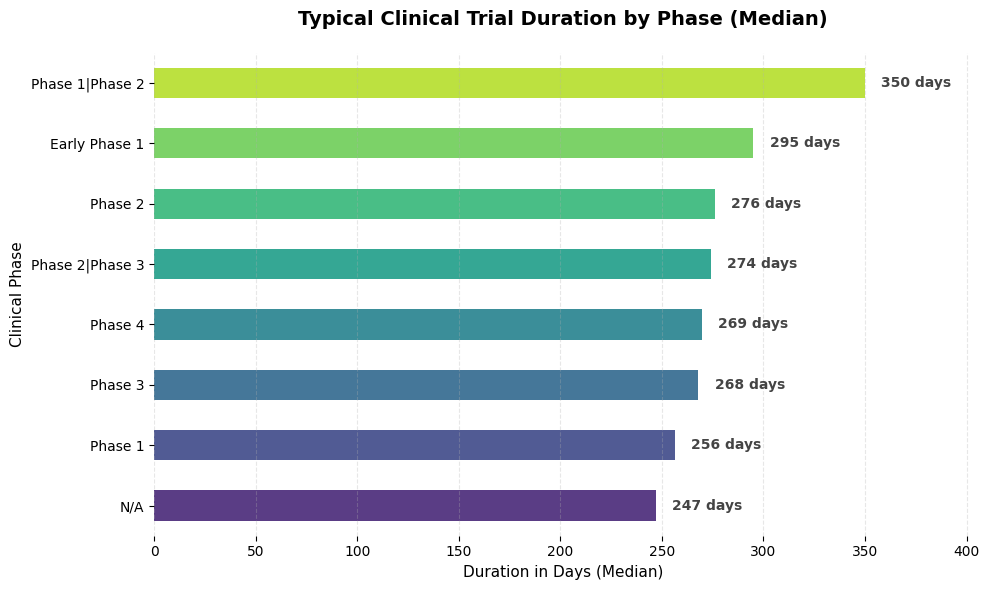

- In turn, while screening and behavioral interventions (bottom) were executed rapidly (Median $\approx$ 60–80 days), complex chronic conditions required longitudinal observation.

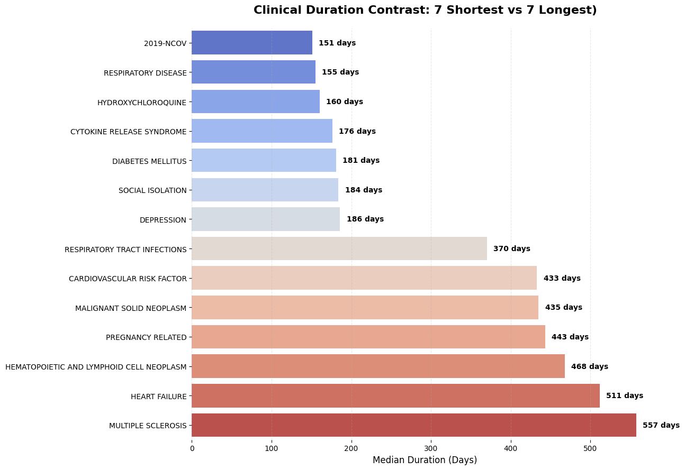

 ---

## Conclusions
The analysis revealed a highly dynamic ecosystem where Interventional studies dominated the research effort to find immediate clinical solutions, while Observational research provided the necessary scale through Big Data and technology-driven recruitment to understand the disease's broader impact. While there is much room for improvement in terms of data cleaning and transformation, this analysis proves its value in filtering noise and pinpointing logistical anomalies, such as failure patterns across study types and funding sources, as well as the variations in trial durations across different clinical phases and medical conditions.
